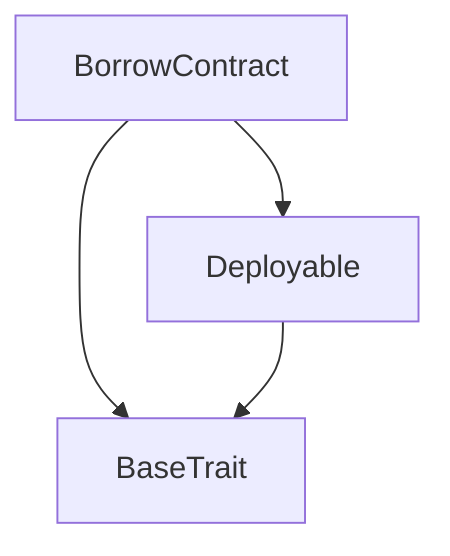
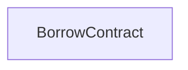

# TACT Compilation Report
Contract: BorrowContract
BOC Size: 1964 bytes

# Types
Total Types: 12

## StateInit
TLB: `_ code:^cell data:^cell = StateInit`
Signature: `StateInit{code:^cell,data:^cell}`

## Context
TLB: `_ bounced:bool sender:address value:int257 raw:^slice = Context`
Signature: `Context{bounced:bool,sender:address,value:int257,raw:^slice}`

## SendParameters
TLB: `_ bounce:bool to:address value:int257 mode:int257 body:Maybe ^cell code:Maybe ^cell data:Maybe ^cell = SendParameters`
Signature: `SendParameters{bounce:bool,to:address,value:int257,mode:int257,body:Maybe ^cell,code:Maybe ^cell,data:Maybe ^cell}`

## Deploy
TLB: `deploy#946a98b6 queryId:uint64 = Deploy`
Signature: `Deploy{queryId:uint64}`

## DeployOk
TLB: `deploy_ok#aff90f57 queryId:uint64 = DeployOk`
Signature: `DeployOk{queryId:uint64}`

## FactoryDeploy
TLB: `factory_deploy#6d0ff13b queryId:uint64 cashback:address = FactoryDeploy`
Signature: `FactoryDeploy{queryId:uint64,cashback:address}`

## UserInfo
TLB: `_ creditScore:int257 totalBorrowed:int257 totalCollateral:int257 erc20Collateral:dict<address, int> nftCollateral:dict<address, int> = UserInfo`
Signature: `UserInfo{creditScore:int257,totalBorrowed:int257,totalCollateral:int257,erc20Collateral:dict<address, int>,nftCollateral:dict<address, int>}`

## SetCreditScore
TLB: `set_credit_score#00000123 user:address creditScore:int257 = SetCreditScore`
Signature: `SetCreditScore{user:address,creditScore:int257}`

## Borrow
TLB: `borrow#00000456 collateralToken:address collateralAmount:int257 borrowAmount:int257 = Borrow`
Signature: `Borrow{collateralToken:address,collateralAmount:int257,borrowAmount:int257}`

## RedeemERC20
TLB: `redeem_erc20#00000789 collateralToken:address collateralAmount:int257 = RedeemERC20`
Signature: `RedeemERC20{collateralToken:address,collateralAmount:int257}`

## PerformLiquidation
TLB: `perform_liquidation#00000abc user:address = PerformLiquidation`
Signature: `PerformLiquidation{user:address}`

## BorrowContract$Data
TLB: `null`
Signature: `null`

# Get Methods
Total Get Methods: 0

# Error Codes
2: Stack underflow
3: Stack overflow
4: Integer overflow
5: Integer out of expected range
6: Invalid opcode
7: Type check error
8: Cell overflow
9: Cell underflow
10: Dictionary error
13: Out of gas error
32: Method ID not found
34: Action is invalid or not supported
37: Not enough TON
38: Not enough extra-currencies
128: Null reference exception
129: Invalid serialization prefix
130: Invalid incoming message
131: Constraints error
132: Access denied
133: Contract stopped
134: Invalid argument
135: Code of a contract was not found
136: Invalid address
137: Masterchain support is not enabled for this contract
6935: Credit score not set
7177: User not found
21436: Only owner can perform liquidation
26068: Credit score out of range
47933: Insufficient collateral
60323: Insufficient collateral balance
60939: Only owner can set credit score
61795: No collateral found

# Trait Inheritance Diagram

# Contract Dependency Diagram

